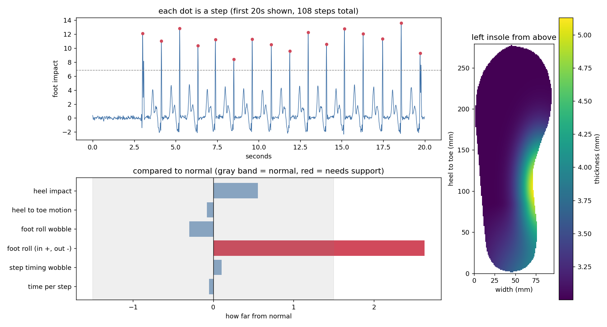

# Balance Track

**A shoe insole that watches how you walk, then designs a custom insole to help you stay steady.**

Some people have balance problems caused by their inner ear (called vestibular disorders). Their feet can roll inward or outward, or wobble from step to step, which makes falls more likely. Therapy for this usually costs $100-200 per session. Balance Track tries to help for a one-time cost of about $121.

I built this between September 2025 and April 2026 and am only putting it on GitHub now, in September 2026. The code was cleaned up and reorganized for this upload, so it won't match the original prototype line for line.

## The idea in 3 steps

```
1. SCAN              2. READ                   3. PRINT
walk with the   ->   the computer looks   ->   a 3D printer makes
sensor insole        for problems in           an insole with extra
                     how you step              support where you need it
```

**1. Scan.** You put the sensor insole in your shoe and walk normally for 2-3 minutes. A tiny computer inside it (an ESP32) records how your foot moves 100 times every second: how hard your heel hits the ground, and how much your foot tilts and rolls.

**2. Read.** When you're done, the insole makes its own WiFi network and sends the recording to a laptop. The laptop program:

- counts each step by finding the moment your heel hits the ground
- measures things like how far your foot rolls to one side and how steady your steps are
- compares your numbers to what's normal for someone your height and weight

**3. Print.** Wherever your walking is noticeably off from normal, the program adds support to that part of the insole. It makes a 3D model file (an STL) in your shoe size that you can send to any 3D printer.

| If your foot... | the insole gets... |
| --- | --- |
| rolls inward | a raised arch on the inside |
| rolls outward | a thicker outer edge |
| wobbles a lot from step to step | a deeper heel cup and a firmer base |
| slams down hard on the heel | extra padding under the heel |

If your walking looks normal, you just get a flat 3 mm insole.

Here's what the report looks like for a sample walk (made with simulated data) where the foot rolls inward:



- **Top:** each red dot is a detected step.
- **Bottom left:** red bars are the measurements that were off from normal.
- **Right:** the insole seen from above. Brighter areas are thicker.

## A few problems I had to solve

- **Keeping the timing even.** Saving to memory after every reading was too slow and messed up the timing, so the insole saves readings in batches of 200 instead.
- **Stopping the sensor from drifting.** Motion sensors slowly lose track of which way is up. The insole constantly corrects itself using the direction of gravity, so it stays accurate for the whole walk.
- **Not counting a step twice.** Your heel bounces slightly when it lands, which can look like two steps. After each step the program ignores the next 0.35 seconds.
- **Making a printable shape.** A 3D printer needs a fully closed shape with no holes. The program checks every model before saving it.

## What's in here

```
firmware/    code that runs on the insole (ESP32, Arduino)
analysis/    laptop program that reads the walk and makes the 3D model (Python)
examples/    a sample walk so you can try it without the hardware
docs/        images for this page
```

## Parts

- ESP32 board (the tiny computer)
- MPU6050 motion sensor (measures tilt and impact)
- BMP280 pressure sensor (measures altitude, like going up stairs)
- a push button
- small rechargeable battery and charger board
- PLA filament for a firm insole, or TPU if you want it softer

Wiring instructions are in [firmware/README.md](firmware/README.md).

## Try it yourself

You need Python 3.8 or newer.

**Install:**

```
python -m venv .venv
.venv\Scripts\activate
pip install -e "analysis[dev]"
```

(On Mac or Linux, use `source .venv/bin/activate` for the second line.)

**Try it with the sample walk (no hardware needed):**

```
balancetrack run examples/sample_session.csv --height 175 --weight 70 --shoe 10 --foot left --both -o out
```

This makes an `out` folder with the report image and 3D models for both feet.

**With the real insole:**

1. Press the button. Keep your foot still while the light blinks fast (about 2 seconds). Then walk for 2-3 minutes and press the button again.
2. On your laptop, connect to the WiFi network called `BalanceTrack`.
3. Download the walk: `balancetrack fetch -o data`
4. Make the insole (use your own height in cm, weight in kg and shoe size):
   `balancetrack run data/s001.csv --height 175 --weight 70 --shoe 10 --foot left --both -o out`
5. Open `out/insole_left.stl` in your 3D printer's software and print it.

Shoe sizes can be `us-men` (the default), `us-women`, `uk` or `eu`. For example: `--shoe 42 --system eu`.

**Other commands:**

| Command | What it does |
| --- | --- |
| `balancetrack analyze` | makes the report only, without the 3D model |
| `balancetrack build` | makes the 3D model from a report you already ran |
| `balancetrack simulate` | makes a fake walk to test with |

To run the tests: `pytest analysis/tests`

## Printing tips

- 0.2 mm layer height, 3 walls, 20-30% infill
- No supports needed, since the bottom is flat
- Trim the toe with scissors if it's a little long for your shoe

## Please note

This is a student project, **not a medical device**. It doesn't replace a doctor, physiotherapist or a professionally made orthotic. The "normal" values it compares against are rough estimates and can be changed in `analysis/balancetrack/data/reference_norms.json`.
